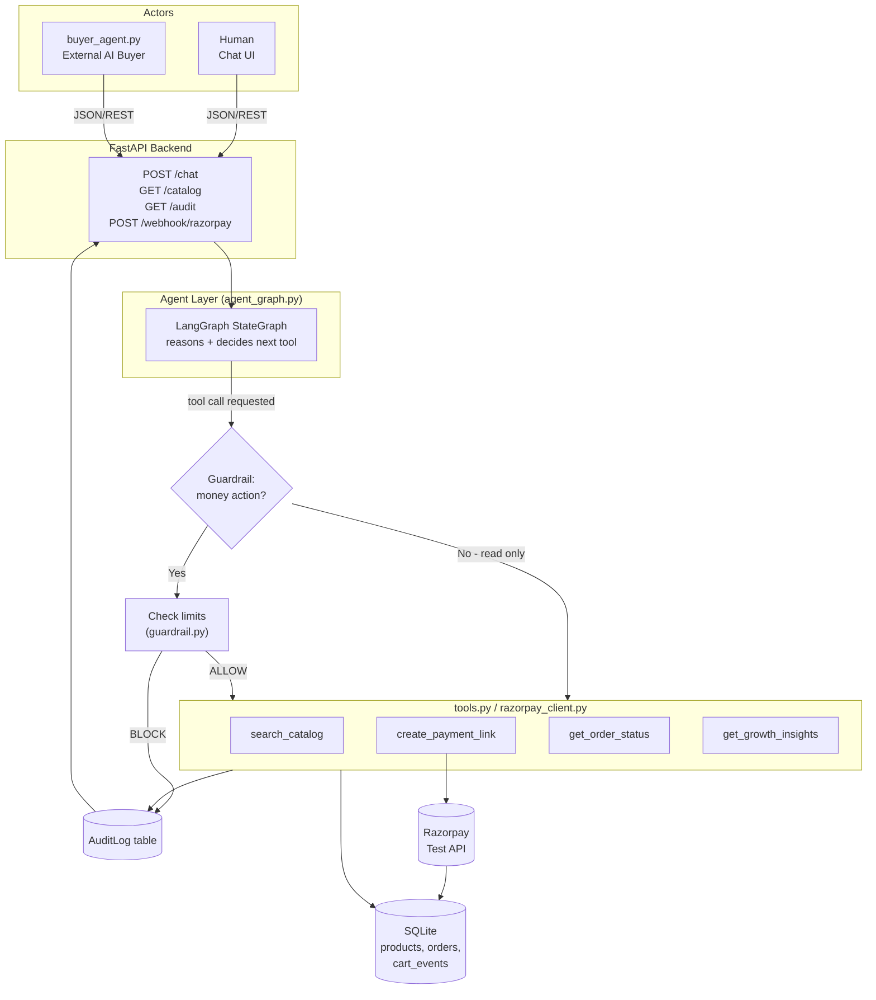
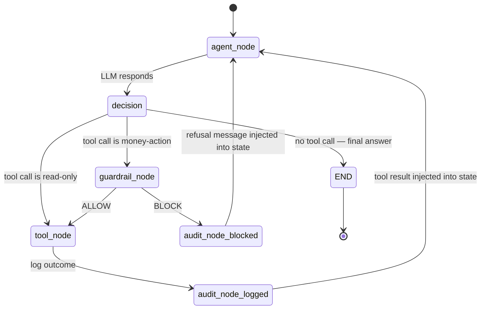

# GrowthMate — Architecture, Integrations & Agent Orchestration

> AI Growth & Agentic Commerce — a merchant-side agent on Razorpay test-mode APIs,
> built so it can transact with both a human buyer and an autonomous AI buyer agent,
> with every money action bounded, gated, and audited.

---

## 1. System Overview

GrowthMate is a FastAPI backend exposing one conversational endpoint (`/chat`) used
by two different actors — a human via a chat UI, and a standalone script
(`buyer_agent.py`) simulating an external AI purchasing agent — plus a machine-readable
catalog (`/catalog`) and an audit trail (`/audit`). All reasoning is done by an LLM
through explicit tool calling; all money-moving tool calls pass through a deterministic
guardrail layer before touching Razorpay; every decision, allowed or blocked, is written
to an `AuditLog` table.

---

## 2. Full Integration Breakdown

| # | Component | Technology | Purpose | Talks to |
|---|---|---|---|---|
| 1 | HTTP API layer | FastAPI + Pydantic | Receives JSON requests, validates shape, routes to agent layer | Frontend, buyer_agent.py |
| 2 | LLM reasoning | Anthropic Claude API (tool-use) | Decides what to say and which tool to call, given conversation + tool schemas | Agent layer |
| 3 | Tool-schema binding | LangChain (`ChatAnthropic` + tool binding) | Defines each tool's JSON schema once, reused by both the manual loop and LangGraph | LLM, Agent layer |
| 4 | Agent orchestration | LangGraph (`StateGraph`) | Explicit state machine controlling the reasoning → guardrail → tool → audit loop | Guardrail, Tools, DB |
| 5 | Guardrail / policy layer | Plain Python (`guardrail.py`) | Deterministic, non-LLM enforcement of spend limits and actor rules before any money action executes | Agent layer, Tools |
| 6 | Product catalog (internal) | SQLAlchemy tool function `search_catalog` | Lets the agent query products during reasoning | SQLite |
| 7 | Product catalog (external) | `GET /catalog` REST endpoint | Self-describing JSON any external agent can read without knowing internal schema conventions | buyer_agent.py, any 3rd-party agent |
| 8 | Payments | Razorpay Python SDK, test-mode keys | Creates real payment links / orders, receives webhook on payment status change | Guardrail (gate), DB, webhook route |
| 9 | Persistence | SQLite + SQLAlchemy ORM | Stores `Product`, `Order`, `CartEvent`, `AuditLog` | All backend components |
| 10 | Audit trail | `AuditLog` table + `GET /audit` endpoint | Every tool call (search, checkout attempt, block, success, failure) logged with actor, tool, params, reasoning, decision, outcome | DB, frontend audit viewer |
| 11 | External AI buyer | `buyer_agent.py` (standalone script, `httpx`/`requests`) | Proves agent-to-agent commerce: a second, independent agent transacts against our API exactly like a real third-party buyer would | `/catalog`, `/chat` |
| 12 | Frontend (human) | HTML/CSS/vanilla JS | Chat interface for the human buyer journey | `/chat` |
| 13 | Frontend (audit) | `audit.html` | Human-readable view of the audit trail for demo purposes | `/audit` |
| 14 | Testing | pytest + httpx `TestClient` | Verifies tools, guardrail logic, and endpoints independently | All backend modules |
| 15 | Deployment | Render or Railway | Hosts the FastAPI process with a public URL | End users / judges |
| 16 | Version control | Git + GitHub | Incremental, per-step commit history as evaluable evidence of process | — |
| 17 *(optional)* | Protocol exposure | MCP server wrapper over tools | Makes tools discoverable by any MCP-compatible external agent, not just our own `buyer_agent.py` | Agent layer (only if Day 5 finishes early) |

---

## 3. Skills & Concepts Required, Mapped to Each Integration

| Integration | Skills/concepts you need before building it |
|---|---|
| FastAPI + Pydantic | Python venv/packaging, REST verbs, JSON, Pydantic models for request/response validation |
| Anthropic Claude API | API key/auth handling, message roles (system/user/assistant), token limits, tool-use response format |
| LangChain tool binding | JSON Schema basics (types, required fields), how a Python function becomes a callable "tool" the LLM can request |
| LangGraph orchestration | State machine thinking: nodes = units of work, edges = transitions, conditional edges = branching logic, a shared mutable `state` dict passed between nodes |
| Guardrail layer | Basic security/systems thinking — allow-lists, numeric threshold checks, why enforcement must live in code, not in a prompt |
| SQLAlchemy / SQLite | ORM basics: models = tables, sessions = transactions, queries via Python not raw SQL |
| Razorpay integration | Orders API vs Payment Links API, test vs live mode keys, webhook signature verification (HMAC), idempotency |
| Audit logging design | What fields make a log line "explainable" (actor, intent, decision, reason, timestamp, outcome) — this is a design skill, not a library |
| buyer_agent.py | Writing an HTTP client script (`requests`/`httpx`), simulating another system's behavior against your own API — useful "systems thinking" skill beyond just backend code |
| Frontend | `fetch()`, basic DOM updates, no framework needed — keeps risk low under deadline |
| Testing | pytest fixtures, FastAPI's `TestClient`, testing pure functions (guardrail) separately from I/O-bound ones (tools) |
| Deployment | Environment variables in a hosted platform, `Procfile`/start command, checking logs on a remote host |
| Git/GitHub | Branching for risky changes, meaningful atomic commits, `.gitignore` discipline for secrets |

This table doubles as your **interview/defense prep sheet** — if a judge asks "how does X work," this row tells you exactly what to explain and why it's there.

---

## 4. Architecture Diagram



---

## 5. Agent Orchestration (LangGraph)

**State schema** (the object passed between every node):

```python
class AgentState(TypedDict):
    messages: list        # full conversation so far, incl. tool results
    actor: str             # "human" or "buyer_agent" - drives guardrail rules
    session_id: str
    spend_so_far: float    # running total this session, checked by guardrail
    pending_tool_call: dict | None
```

**Nodes**
- `agent_node` — calls the LLM with `messages` + tool schemas, gets back either a final text reply or a requested tool call.
- `guardrail_node` — only entered if the requested tool is money-moving (`create_payment_link`). Deterministically checks `spend_so_far + requested_amount` against per-transaction and per-session limits, and checks `actor` against an allow-list. Outputs `ALLOW` or `BLOCK` with a reason string.
- `tool_node` — executes the actual Python function (`search_catalog`, `create_payment_link`, etc.) and appends the result to `messages`.
- `audit_node` — writes one row to `AuditLog` for every pass through here: actor, tool name, parameters, guardrail decision, reason, outcome, timestamp. Runs on both the ALLOW/success path and the BLOCK path.

**Flow**



**Why this shape matters for the brief**: the loop physically cannot let the LLM's
"opinion" be the last word on a money action — `guardrail_node` sits *between* the
agent's decision and execution, is plain deterministic code, and always writes to
`audit_node` regardless of outcome. That's what makes "every money action explainable,
bounded and gated" a structural property of the system rather than a prompting
convention, and it's exactly what you point to for both the failure-handling
requirement and the audit-trail requirement in the brief.

---

## 6. Two Concrete Journeys Through This Graph

**Journey A — normal purchase (human)**
`agent_node` (LLM decides to call `create_payment_link`) → `guardrail_node` (₹1500 request, limit ₹5000 → ALLOW) → `tool_node` (Razorpay link created, order row inserted) → `audit_node` (logged: ALLOW, success) → `agent_node` (LLM tells user the link) → END.

**Journey B — the engineered failure (buyer_agent.py)**
`agent_node` (buyer agent requests a ₹50,000 purchase) → `guardrail_node` (exceeds per-transaction limit → BLOCK, reason: "exceeds max per-transaction limit of ₹5,000") → `audit_node` (logged: BLOCK, reason recorded) → `agent_node` (LLM returns a structured refusal, not a crash) → buyer_agent.py receives a clean JSON error it can react to → END.

This second trace is your live demo of "one failure handled gracefully" — show the
`/audit` row for it as proof.

---

## 7. Where This Lives in the Repo

- This file: `docs/ARCHITECTURE.md`
- Diagrams render automatically on GitHub (Mermaid support is native)
- Reference this file directly from `README.md` under an "Architecture" section
