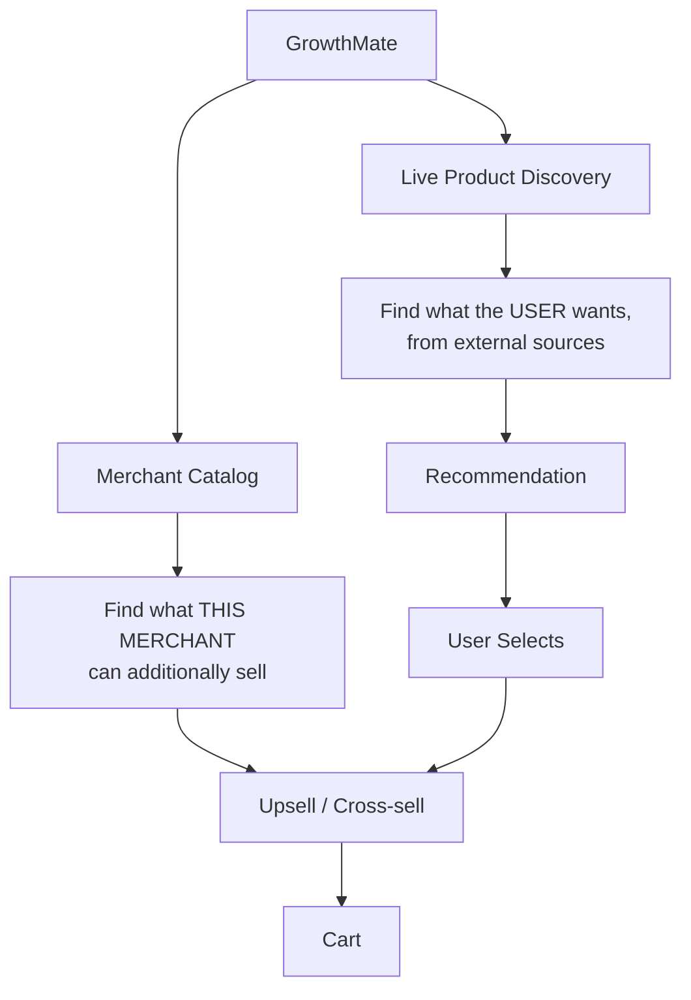
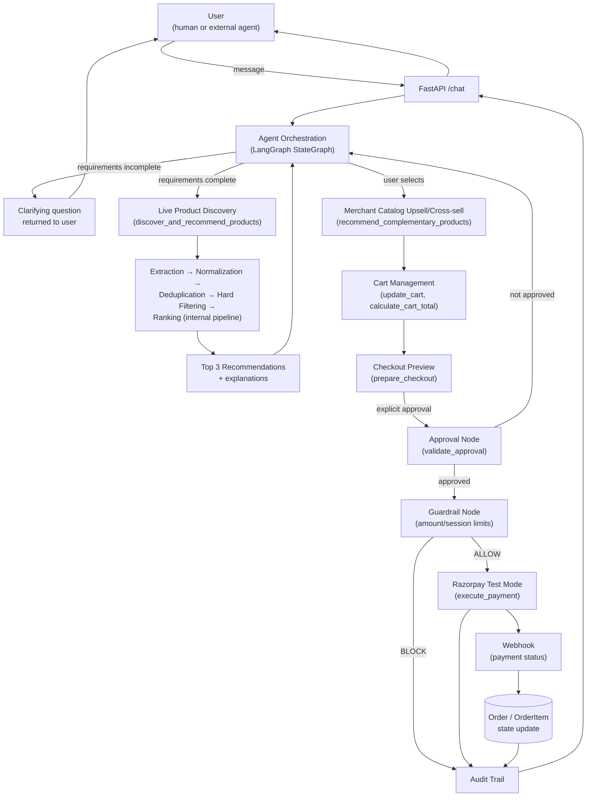
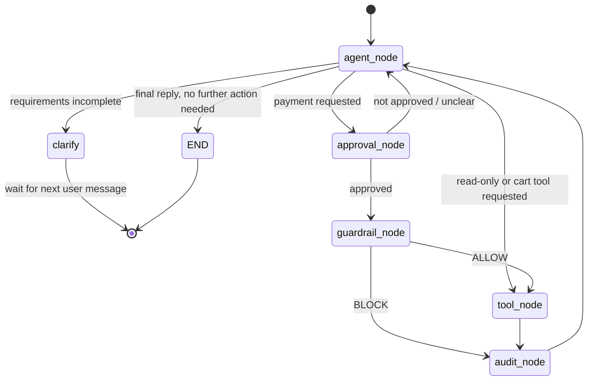
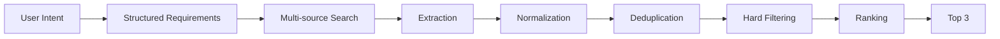
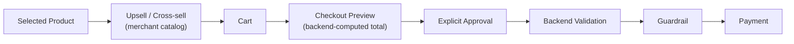

# GrowthMate — Architecture, Integrations & Agent Orchestration

> **Revision 2.** Supersedes the earlier catalog-only, buyer-agent-first version of
> this document. GrowthMate is now an AI shopping and merchant-growth agent that
> performs live, multi-source product discovery, understands and clarifies user
> requirements, recommends the best matches, upsells from the merchant's own
> catalog, and gates every money action behind explicit approval and a
> deterministic guardrail before touching Razorpay.

---

## 1. System Overview

A user (human, or an external AI agent calling the same API) describes what they
want to buy. GrowthMate first determines whether it has enough information to
search usefully — if not, it asks a clarifying question and waits. Once the
requirement is structured (category, budget, brand, features, etc.), it performs
**live multi-source product discovery**: searching accessible external sources,
extracting product data, normalizing it into a common shape, removing duplicates,
applying hard constraints (budget, required features), ranking what remains, and
presenting the **best 3 matches** with a short explanation for each.

Once the user picks one, GrowthMate suggests 2–3 **complementary products it can
fulfill through the merchant's own catalog** — this upsell/cross-sell step is the
mechanism by which the project actually grows *this specific merchant's* revenue,
not just satisfies the user's original request. The user builds a cart, sees a
**deterministic, backend-computed checkout preview**, and must give **explicit
approval** before anything is attempted at Razorpay. Every money-moving action
passes an approval check and a deterministic guardrail before execution. Every
stage — requirement extraction through payment result — is written to an audit
trail.

This document describes the **target architecture**. Implementation status per
component is tracked explicitly in §9 — nothing here is claimed as built unless
marked so.

---

## 2. Two Distinct Product Sources

This split exists because the brief is dual-purpose: help the user find what they
actually want (which the merchant may not even sell), **and** grow this specific
merchant's revenue (which only happens through items the merchant can fulfill).
Conflating the two would either shrink the user's search to a tiny internal
catalog (bad for the user) or never route any revenue to the merchant (bad for
the growth objective). The merchant catalog is never the primary discovery
mechanism — it is the upsell/cross-sell source, entered only after a product has
already been selected from live discovery.

---

## 3. Full Integration Breakdown

| # | Component | Technology | Purpose | Status |
|---|---|---|---|---|
| 1 | HTTP API layer | FastAPI + Pydantic | Receives requests, validates shape, routes to agent | Implemented |
| 2 | LLM reasoning | Gemini (or swappable via LangChain) | Requirement understanding, clarification, tool-call decisions, recommendation explanation | Implemented (provider swappable) |
| 3 | Tool-schema binding | LangChain | Defines each tool's JSON schema once, provider-neutral | Implemented |
| 4 | Agent orchestration | LangGraph (`StateGraph`) | State machine: reason → (approve →) guardrail → execute → audit | Implemented, extended (§6) |
| 5 | Requirement Understanding | LLM reasoning inside `agent_node` | Converts conversation into structured requirements; detects missing info | Planned |
| 6 | Clarification loop | `agent_node` self-loop | Asks a clarifying question and waits for the next user turn when requirements are incomplete | Planned |
| 7 | Live Product Discovery | New tool `discover_and_recommend_products` | Searches accessible external sources, extracts, normalizes, dedupes, filters, ranks, returns top 3 | Planned |
| 8 | Merchant Catalog | SQLAlchemy `Product` table + `get_merchant_products` / `recommend_complementary_products` tools | Source for upsell/cross-sell only | Partial (table exists; tools need extension) |
| 9 | Cart Management | New tools `update_cart`, `calculate_cart_total` | Deterministic, backend-computed cart contents and total — never LLM-computed | Planned |
| 10 | Checkout & Approval Gate | New tools `prepare_checkout`, `validate_approval` + new `approval_node` | Shows a checkout preview, requires explicit approval before any guardrail/payment step | Planned |
| 11 | Guardrail / policy layer | Plain Python (`guardrail.py`) | Deterministic enforcement of spend limits and actor rules | Implemented, extended (§6) |
| 12 | Payments | Razorpay Python SDK, test-mode keys | Real payment links against a test-mode account | Implemented |
| 13 | Persistence | SQLite + SQLAlchemy | `Product`, `ExternalProductListing`, `CartItem`, `Order`, `OrderItem`, `AuditLog` | Partial — schema extended, see LLD §2 |
| 14 | Audit trail | `AuditLog` + `GET /audit` | Every pipeline stage logged: discovery, ranking, selection, upsell, cart change, checkout, approval, guardrail, payment | Partial — event types expanded |
| 15 | External AI buyer | `buyer_agent.py` | Same public API used by an independent script — now a **secondary** demonstration path, not the primary architecture | Implemented, deprioritized (§10) |
| 16 | Frontend (human) | HTML/CSS/vanilla JS | Chat interface | Implemented |
| 17 | Frontend (audit) | `audit.html` | Audit trail viewer | Implemented |
| 18 | Testing | pytest + httpx | Unit/endpoint tests | Partial |
| 19 | Deployment | Render | Hosts the FastAPI process | Planned |
| 20 | Version control | Git + GitHub | Commit history | Implemented |
| 21 *(optional)* | MCP server wrapper | Only if time allows | Not required for current scope | Optional |

---

## 4. Skills & Concepts Required (updated)

| Integration | Skills/concepts needed |
|---|---|
| Requirement understanding | Prompting for structured extraction, deciding "is this enough to search on?" |
| Clarification loop | Multi-turn conversation state, distinguishing a question from a final answer |
| Live product discovery | Calling external search/product-data sources, handling missing/blocked/stale results gracefully |
| Extraction / normalization / dedup | Turning heterogeneous source data into one internal shape; simple similarity checks for duplicates |
| Hard filtering & ranking | Deterministic filtering by mandatory constraints; explainable, non-ML ranking heuristics |
| Merchant catalog / upsell design | Distinguishing "what the user wants" from "what this merchant can sell"; complementary-product reasoning |
| Deterministic cart math | Why total price must be backend-computed, never trusted from the LLM |
| Approval gate design | Why "explicit approval" must be a backend-validated state, not an LLM guess at sentiment |
| Guardrail layer | (unchanged from Revision 1) deterministic threshold checks, never LLM-enforced |
| Razorpay integration | (unchanged) Orders/Payment Links, webhook HMAC verification |
| Audit logging design | Expanded event taxonomy — every pipeline stage, not just money actions |

---

## 5. Architecture Diagram

---

## 6. Agent Orchestration (LangGraph) — Revised

The orchestration skeleton stays deliberately small — **five nodes**, not one node
per pipeline stage — because the multi-stage discovery pipeline (extraction,
normalization, dedup, filtering, ranking) is implemented as **one deterministic
internal pipeline inside a single tool call**, not as separate LLM-orchestrated
tool calls. This is a key design decision: letting the LLM sequence five
sub-steps itself would be slower and less reliable than one deterministic
function doing all five, called once. See §10.

**Nodes**
- `agent_node` — reasons over the conversation. Decides one of: ask a clarifying
  question (no tool call, ends turn), call a read-only/discovery/cart tool, or
  request `execute_payment`. This single node handles requirement understanding,
  clarification, recommendation explanation, and cart conversation — it is one
  reasoning node reused across many turns, not a distinct node per capability
  (per the "don't create a separate agent for every skill" principle).
- `approval_node` — **new**. Deterministically checks that the user's most recent
  message, in the context of a just-shown checkout preview, constitutes explicit
  approval (a defined state transition, not a loose sentiment guess). Only
  entered on the path toward `execute_payment`.
- `guardrail_node` — (unchanged in purpose) checks the payment amount against
  per-transaction/per-session limits. Now only reached *after* `approval_node`
  passes — approval and spend-limit enforcement are deliberately two separate,
  independently auditable checks.
- `tool_node` — executes whichever tool was requested: discovery, merchant
  upsell lookup, cart update, checkout preparation, or (once approved and
  guardrail-cleared) the actual payment.
- `audit_node` — writes one row per pass, for every stage — not only money
  actions. See LLD §2 for the expanded event taxonomy.

**Flow (including the clarification loop)**

---

## 7. Product Discovery Pipeline

Each stage is architecturally distinct and independently loggable (see LLD §2's
audit event taxonomy), even though they execute inside one deterministic pipeline
function rather than as separate agent turns. Sources may be inaccessible, block
automation, return incomplete data, or be stale — the pipeline is designed to
degrade gracefully (skip a failed source, proceed with what's available) rather
than fail the whole request.

---

## 8. Commerce Pipeline

---

## 9. Two Concrete Journeys

**Journey A — normal purchase (human or agent), full pipeline**
Requirement gathering (with one clarifying question) → live discovery → top 3
shown → user selects → 2 upsell items suggested → cart built → checkout preview
shown → user explicitly approves → `approval_node` passes → `guardrail_node`
ALLOW → real Razorpay test link created → webhook updates order → `audit_node`
logs every stage.

**Journey B — engineered failure (guardrail block)**
Same pipeline up to checkout, but the resulting cart total exceeds the actor's
guardrail limit → `approval_node` passes (user did approve) → `guardrail_node`
BLOCK, reason recorded → `audit_node` logs the block → agent returns a clean
refusal, no crash. `buyer_agent.py` remains a valid way to trigger this
deterministically (§10), though it is no longer the primary architectural
narrative.

*(A second failure mode — a Razorpay payment failure post-approval — is also
architecturally supported: `execute_payment` catches SDK errors, marks the order
`failed`, logs it, and the agent informs the user their card was not charged.
This is Planned, not yet implemented.)*

---

## 10. Key Architectural Decisions

- **The discovery pipeline is one deterministic tool, not five LLM-orchestrated
  tool calls.** Reliability and latency both favor a single internal pipeline
  function over trusting the LLM to sequence extraction → normalization → dedup
  → filtering → ranking correctly, every time, across many external sources.
- **Cart total is always backend-computed**, never accepted from or trusted to
  the LLM — this is a hard rule carried over unchanged from the original
  guardrail philosophy, just applied one layer earlier (§9 problem statement).
- **Approval is a separate, deterministic node from the guardrail**, because
  "did the user actually agree to this specific checkout" and "is this amount
  within policy limits" are two different questions with two different failure
  modes worth auditing separately.
- **The merchant catalog is upsell-only, never the primary search.** This
  preserves both halves of the brief — genuine user-need discovery, and
  merchant-specific revenue growth — without collapsing them into one weaker
  compromise.
- **`buyer_agent.py` is retained but demoted to a secondary demonstration path.**
  The agent-to-agent story from Revision 1 remains true (the same public API
  serves both actor types), but the primary architectural narrative in this
  revision is the discovery → recommend → upsell → gated-checkout pipeline,
  which better reflects the current product direction.
- **No new infrastructure classes were introduced** (no microservices, no
  message queue, no second database) — the expanded scope is absorbed by a
  richer tool set and a five-node graph, not by additional systems.

---

## 11. Where This Lives in the Repo

- This file: `docs/ARCHITECTURE.md`
- Companion documents: `docs/HIGH_LEVEL_DESIGN.md`, `docs/LOW_LEVEL_DESIGN.md`
- Diagrams render automatically on GitHub (Mermaid support is native)
