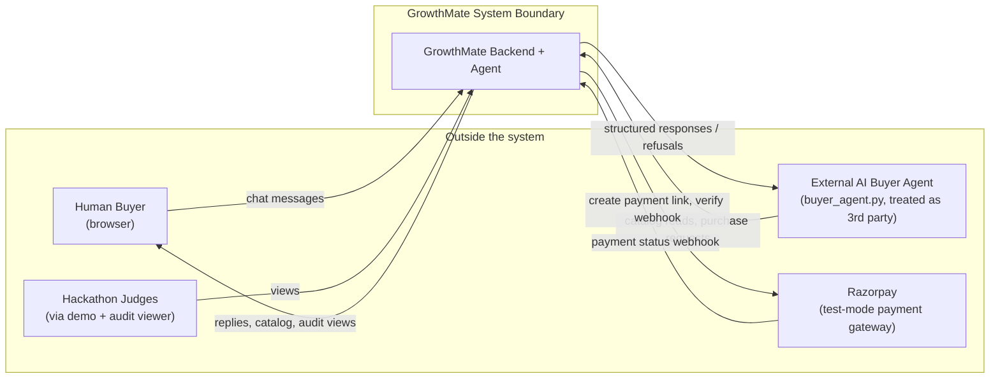
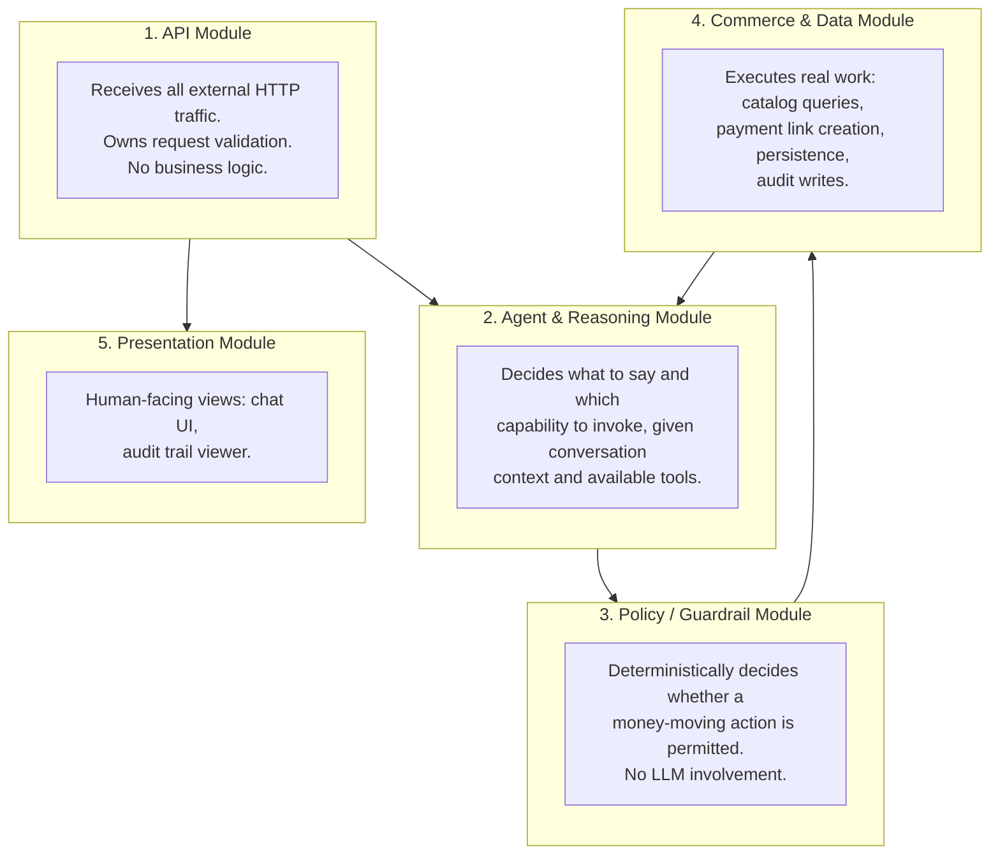
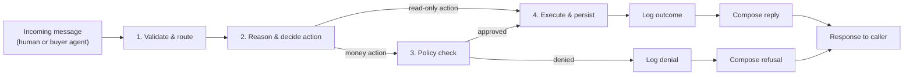
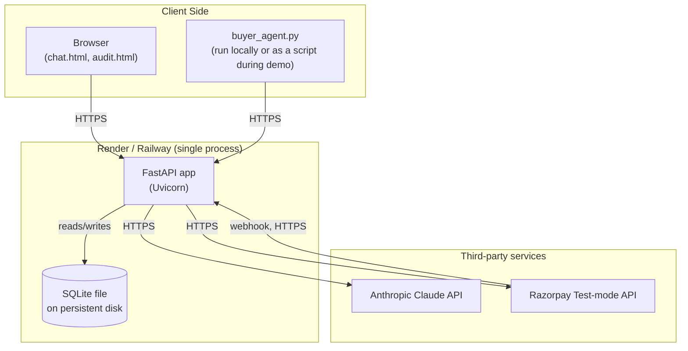

# GrowthMate — High-Level Design (HLD)

> Sits between `docs/ARCHITECTURE.md` (integrations + agent orchestration) and
> `docs/LOW_LEVEL_DESIGN.md` (schemas, function signatures, API payloads).
> This document answers: what modules exist, why, how data flows between them
> at a coarse grain, what quality attributes the system must satisfy, and how
> it's deployed. No field-level or function-level detail lives here — that's LLD.

---

## 1. Purpose & Document Relationship

| Document | Answers |
|---|---|
| `ARCHITECTURE.md` | What's integrated, why, and how the agent orchestration loop is shaped |
| **`HIGH_LEVEL_DESIGN.md` (this file)** | What modules exist, their responsibilities and boundaries, coarse data flow, quality attributes, deployment topology |
| `LOW_LEVEL_DESIGN.md` | Exact schemas, function signatures, API payloads, sequence diagrams |

Read order for a judge or a new contributor: Architecture → HLD → LLD → code.

---

## 2. System Context

Who/what interacts with GrowthMate, and what crosses the system boundary.

**Key boundary decision**: `buyer_agent.py` is architecturally *external* even though we
wrote it — it only ever speaks to the system through the same public REST API a real
third-party AI buyer would use. This is what makes the agent-to-agent claim genuine
rather than simulated internally.

---

## 3. Module Decomposition

Five coarse-grained modules, each independently understandable and testable.

| Module | Responsibility | Does NOT do |
|---|---|---|
| **API** | HTTP contract, input validation, routing to Agent module | Business logic, DB access, LLM calls |
| **Agent & Reasoning** | Converses, decides next action via LLM + tool schemas, maintains conversation state | Enforce spending limits, talk to Razorpay directly |
| **Policy / Guardrail** | Approves/rejects money-moving actions against fixed rules | Reason in natural language, call any external API |
| **Commerce & Data** | Executes tools (search, pay, insights), owns persistence and audit writes | Decide *whether* an action should happen — only *how* to execute it once approved |
| **Presentation** | Renders chat + audit trail for humans | Contain any decision logic |

This decomposition is deliberately the same shape as the LangGraph node design in the
LLD — the module boundaries and the graph node boundaries are the same boundaries,
which is what keeps the system easy to reason about end to end.

---

## 4. High-Level Data Flow

Every path — approved or denied — converges through a logging step before a response
is composed. There is no path from "money action requested" to "response sent" that
skips both the policy module and a persisted log entry.

---

## 5. Technology Stack Summary

| Layer | Choice | High-level reason |
|---|---|---|
| Language/runtime | Python 3.11 | Best-supported ecosystem for both web APIs and LLM tooling |
| API framework | FastAPI | Async, typed, auto-documented — fast to build and fast to demo |
| LLM | Anthropic Claude (tool-use) | Native structured tool calling, no prompt-hacking needed for reliability |
| Agent orchestration | LangGraph | Explicit state machine, makes the "gated" control flow inspectable, not implicit in a prompt |
| Tool abstraction | LangChain | Thin layer reused between manual loop and LangGraph, avoids duplicating tool schemas |
| Data store | SQLite + SQLAlchemy | Zero-ops, transactional, sufficient for hackathon scale, easy to inspect for demo |
| Payments | Razorpay (test mode) | Named explicitly in the problem statement; real API, no real money |
| Frontend | Static HTML/CSS/JS | No build tooling to break under deadline; sufficient for both chat and audit views |
| Testing | pytest + httpx | Standard, fast, allows testing Policy module in isolation from I/O |
| Deployment | Render/Railway | Free tier, persistent process, simple env var config |

---

## 6. Non-Functional Requirements (scoped for a 6-day hackathon)

| Attribute | Requirement | How it's addressed |
|---|---|---|
| **Explainability** | Every money-moving decision must be traceable to a reason | Audit module logs actor, tool, parameters, decision, and reason for every attempt |
| **Boundedness** | No transaction can exceed defined limits, regardless of what the LLM outputs | Policy module is deterministic code sitting between reasoning and execution — not prompt-based |
| **Gatedness** | Money actions require explicit approval before execution | Same as above — no tool executes a payment without passing through the Policy module first |
| **Graceful degradation** | LLM errors, Razorpay errors, and policy denials must not crash the system | All three are caught, logged, and turned into a normal conversational reply |
| **Auditability** | A third party (judge) must be able to inspect what happened without reading code | `/audit` endpoint + `audit.html` viewer |
| **Interoperability** | An external agent must be able to use the system without prior knowledge of internals | `/catalog` is a self-describing, stable JSON contract, decoupled from internal tool schemas |
| **Security (minimum viable)** | Secrets never exposed, webhook payloads verified | `.env`-only secrets, HMAC signature check on Razorpay webhook |
| Scalability, multi-tenancy, high availability | **Explicitly out of scope** | Single-merchant, single-process, SQLite is sufficient — stated as a known simplification, not an oversight |

Stating the last row explicitly matters for your defense: judges respect a scoped
system with clear boundaries far more than an unscoped one with hidden gaps.

---

## 7. Deployment View

One deployed process, one persistent SQLite file, two outbound third-party
dependencies (Claude, Razorpay), one inbound webhook. Deliberately minimal —
nothing here needs a queue, a cache, or multiple services for this scope.

---

## 8. Traceability: HLD Module → LLD Section

| HLD Module | Corresponding LLD section |
|---|---|
| API Module | LLD §3 (REST API Contract) |
| Agent & Reasoning Module | LLD §6 (Agent Layer — LangGraph state/nodes) |
| Policy / Guardrail Module | LLD §5 (Guardrail Layer) |
| Commerce & Data Module | LLD §2 (DB Schema), §4 (Tool Definitions), §7 (Razorpay Integration) |
| Presentation Module | Frontend files (`index.html`, `audit.html`) — not separately detailed in LLD, low complexity |

Use this table when asked "how does the high-level design map to what you actually
built" — it's a direct, one-line-per-row answer.
