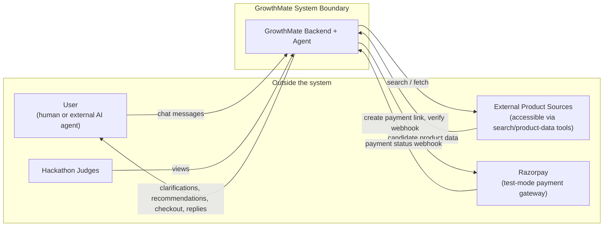
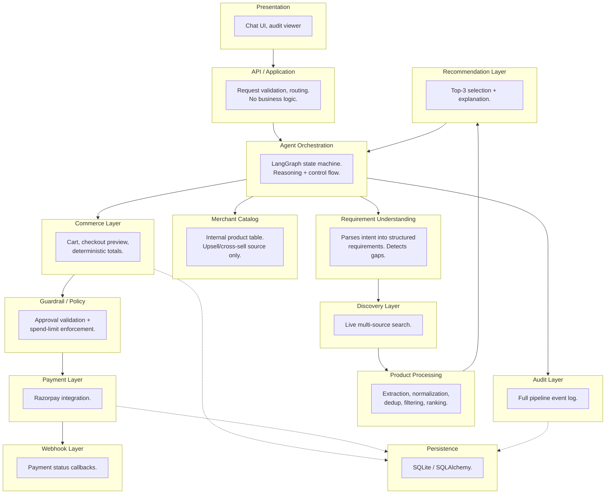
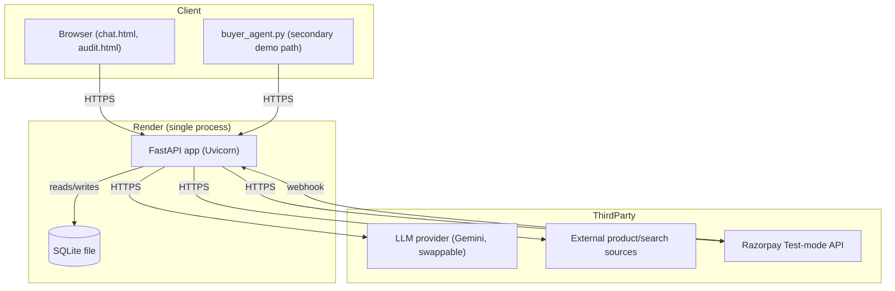

# GrowthMate — High-Level Design (HLD)

> **Revision 2.** Reflects the updated `docs/ARCHITECTURE.md` (discovery,
> requirement understanding, upsell, gated checkout). Sits between Architecture
> (what's integrated and why) and LLD (exact schemas, sequence diagrams).

---

## 1. Purpose & Document Relationship

| Document | Answers |
|---|---|
| `ARCHITECTURE.md` | What's integrated, why, agent orchestration shape |
| **This file** | What modules exist, boundaries, coarse data flow, NFRs, deployment |
| `LOW_LEVEL_DESIGN.md` | Exact schemas, function signatures, API payloads, sequence diagrams |

---

## 2. System Context

**Key boundary note**: external product sources are outside the system boundary
and are not guaranteed to be complete, fast, or always accessible — the Discovery
Layer (§3) is designed to degrade gracefully when a source fails, not to fail the
whole request.

---

## 3. Module Decomposition

| Module | Responsibility | Does NOT do |
|---|---|---|
| Presentation | Renders chat + audit for humans | Any decision logic |
| API / Application | HTTP contract, validation, routing | Business logic, DB access |
| Agent Orchestration | Runs the LangGraph state machine, holds conversation state | Enforce spend limits, talk to Razorpay directly |
| Requirement Understanding | Extracts structured requirements from conversation, flags missing fields | Search external sources itself |
| Discovery Layer | Calls external search/product-data sources | Rank or filter results itself |
| Product Processing | Deterministic pipeline: extract → normalize → dedup → filter → rank | Decide what the user wants (that's Requirement Understanding) |
| Recommendation Layer | Selects/formats the top 3 with explanations | Perform the ranking math (that's Product Processing) |
| Merchant Catalog | Serves upsell/cross-sell candidates only | Serve as primary product discovery |
| Commerce Layer | Cart state, checkout preview, **deterministic total calculation** | Decide whether payment is approved (that's Guardrail/Policy) |
| Guardrail / Policy | Validates explicit approval + spend limits, deterministically | Reason in natural language |
| Payment Layer | Calls Razorpay, handles SDK errors | Decide whether a payment should be attempted |
| Webhook Layer | Verifies and processes Razorpay callbacks | Any decision logic |
| Audit Layer | Persists one log row per pipeline stage | Any decision logic |
| Persistence | Owns all DB reads/writes | Business logic |

Module boundaries are deliberately coarser than they might first appear — several
modules above (Requirement Understanding, Recommendation Layer) are **responsibilities
carried out by the same `agent_node`** in the LangGraph orchestration (see
Architecture §6), not separate services or separate LLM calls. The module diagram
represents *conceptual* responsibility boundaries useful for reasoning and testing,
not a 1:1 map to deployed processes.

---

## 4. High-Level Data Flow

```mermaid
flowchart LR
    IN["Incoming message"] --> P1["Validate & route"]
    P1 --> P2["Requirement understanding"]
    P2 -->|incomplete| P3["Clarifying question"]
    P3 --> OUT1["Response to user"]
    P2 -->|complete| P4["Live discovery + processing pipeline"]
    P4 --> P5["Top 3 + explanations"]
    P5 --> OUT2["Response to user"]
    P5 -->|user selects| P6["Upsell/cross-sell + cart"]
    P6 --> P7["Checkout preview"]
    P7 -->|explicit approval| P8["Approval validation"]
    P8 -->|approved| P9["Guardrail check"]
    P8 -->|not approved| OUT3["Response to user"]
    P9 -->|allow| P10["Payment execution"]
    P9 -->|block| P11["Log denial"]
    P10 --> P12["Webhook → order update"]
    P11 --> P13["Compose refusal"]
    P12 --> P14["Compose confirmation"]
    P13 --> OUT4["Response to user"]
    P14 --> OUT4
```

Every path that reaches the payment layer passes through both the approval check
and the guardrail check, and every terminal path — clarification, recommendation,
denial, or confirmation — is logged before a response is composed.

---

## 5. Technology Stack Summary

| Layer | Choice | Reason |
|---|---|---|
| Language/runtime | Python 3.11 | Ecosystem fit for web + LLM tooling |
| API framework | FastAPI | Async, typed, auto-documented |
| LLM | Gemini (swappable via LangChain — Groq/Anthropic/Ollama supported through the same interface) | Free tier, reliable tool calling, provider-neutral tool schemas |
| Agent orchestration | LangGraph | Explicit state machine for a now-richer multi-stage flow |
| Tool abstraction | LangChain | Provider-neutral tool schema binding |
| External product discovery | Search/product-data provider(s) called as a tool | Live results instead of a static internal catalog |
| Data store | SQLite + SQLAlchemy | Zero-ops, transactional, sufficient for hackathon scale |
| Payments | Razorpay (test mode) | Named in the problem statement |
| Frontend | Static HTML/CSS/JS | No build tooling to break under deadline |
| Testing | pytest + httpx | Standard, fast |
| Deployment | Render | Free tier, persistent process |

---

## 6. Non-Functional Requirements

| Attribute | Requirement | How it's addressed |
|---|---|---|
| Explainability | Every recommendation and every money decision must be traceable | Audit Layer logs each pipeline stage, not only money actions |
| Boundedness | No transaction can exceed defined limits regardless of LLM output | Guardrail is deterministic code, not prompt-based |
| Gatedness | Payment requires both explicit approval **and** a passing guardrail check | Two independent deterministic nodes, both audited |
| Deterministic commerce math | Cart totals must never be LLM-computed | Commerce Layer computes totals in backend code |
| Graceful degradation | External source failure, LLM error, Razorpay error must not crash the system | Each caught and turned into a normal conversational reply or a skipped source |
| Auditability | A third party must be able to inspect what happened without reading code | `/audit` endpoint + viewer |
| Interoperability | An external agent can use the system without internal knowledge | Public API surface unchanged in shape from Revision 1 |
| Scalability, multi-tenancy, HA | Explicitly out of scope | Single-merchant, single-process, stated as a deliberate simplification |

---

## 7. Deployment View

One deployed process, one persistent SQLite file, three outbound third-party
dependency classes (LLM, external product sources, Razorpay), one inbound
webhook. Still deliberately minimal — no queue, no cache, no second service.

---

## 8. Traceability: HLD Module → LLD Section

| HLD Module | LLD section |
|---|---|
| API / Application | LLD §3 (API Design) |
| Agent Orchestration | LLD §6 (State Schema, Nodes) |
| Requirement Understanding | LLD §4.1 (Requirement/discovery tools) |
| Discovery Layer + Product Processing | LLD §4.1, §7 (Discovery pipeline detail) |
| Recommendation Layer | LLD §4.1 |
| Merchant Catalog | LLD §4.2 |
| Commerce Layer | LLD §4.3, §9 (Cart & Checkout design) |
| Guardrail / Policy | LLD §5 (Guardrail Design, extended with Approval Validation) |
| Payment Layer | LLD §4.4, §10 |
| Webhook Layer | LLD §10 |
| Audit Layer | LLD §2 (AuditLog + event taxonomy) |
| Persistence | LLD §2 (Data Model) |
