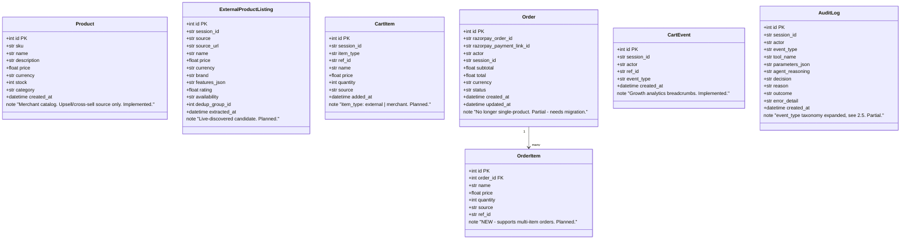
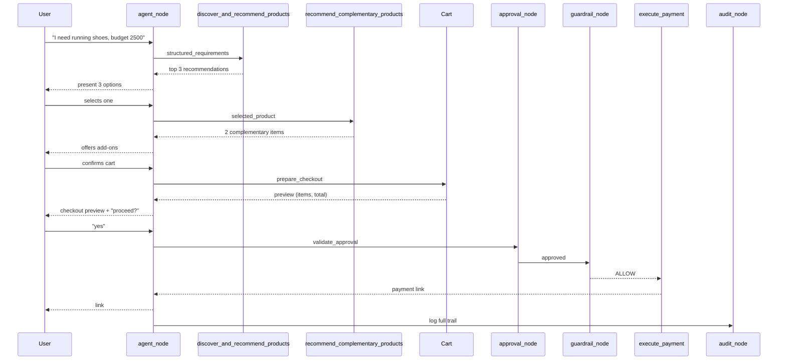
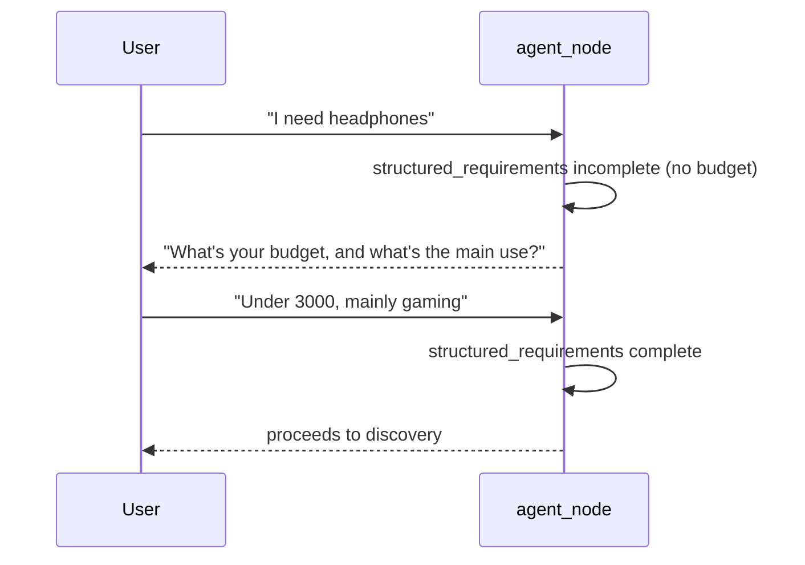
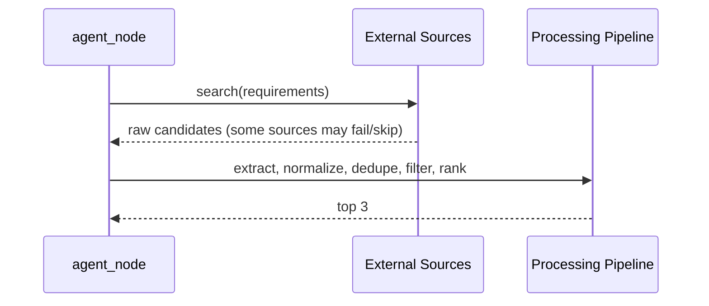
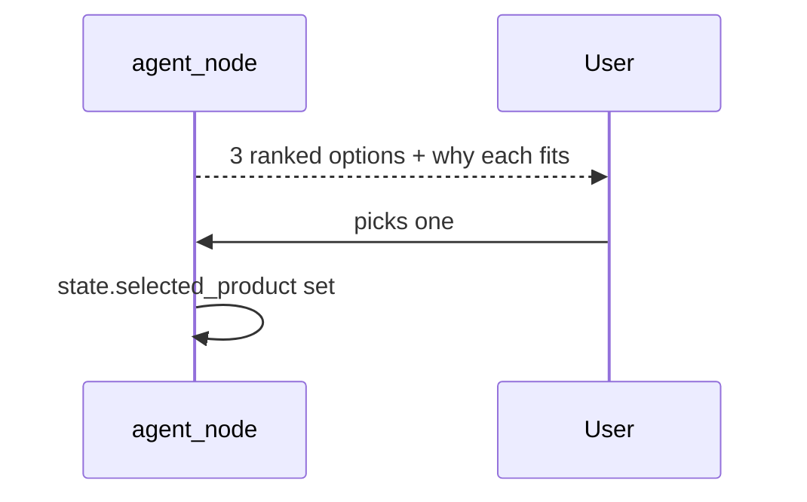
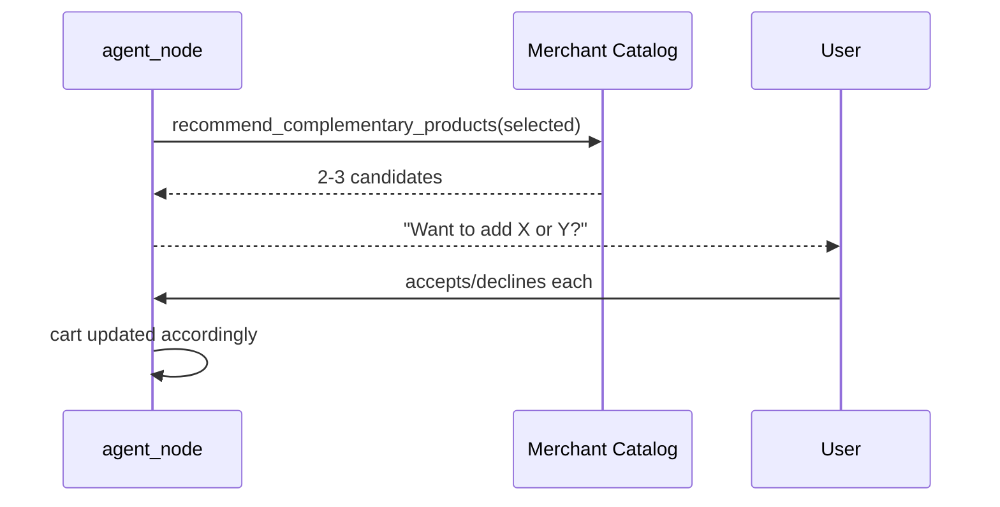
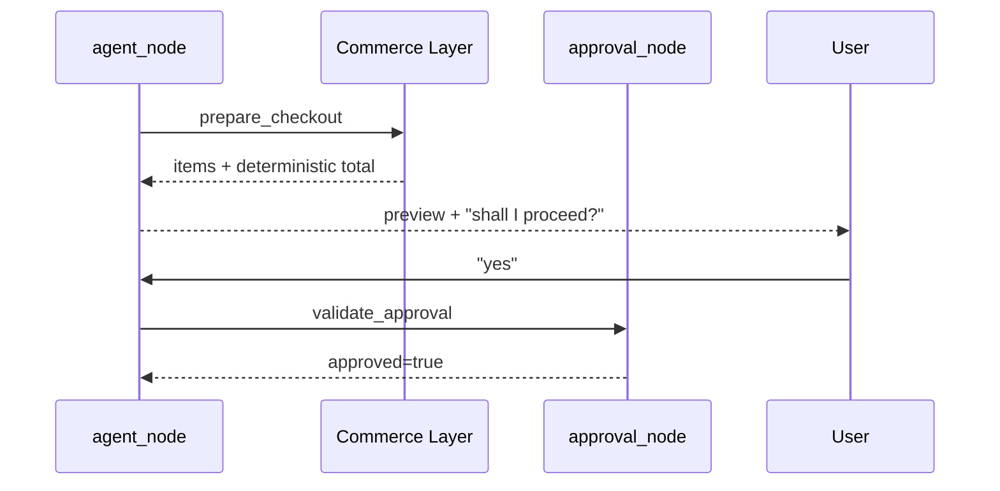
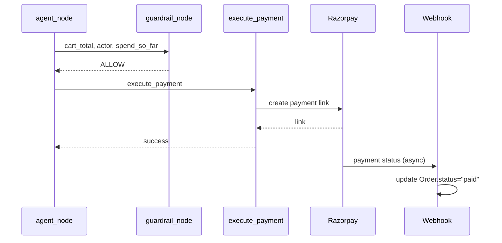

# GrowthMate — Low-Level Design (LLD)

> **Revision 2.** Implementation-oriented design consistent with `docs/ARCHITECTURE.md`
> and `docs/HIGH_LEVEL_DESIGN.md` Revision 2. Supersedes the single-product,
> catalog-only LLD. Status labels (Implemented / Partial / Planned) are given per
> section — nothing here is claimed built unless marked so.

---

## 1. Scope

Data model, API contracts, tool design, state schema, guardrail/approval design,
discovery pipeline detail, cart/checkout/payment design, and nine sequence
diagrams covering the full pipeline plus its failure paths.

---

## 2. Data Model



### 2.1 `products` (merchant catalog) — Implemented, unchanged from Revision 1
Same columns as before: `id, sku, name, description, price, currency, stock, category, created_at`.

### 2.2 `external_product_listings` — Planned (new)
Holds one row per candidate product surfaced by live discovery for a given
session. `dedup_group_id` groups listings judged equivalent (same `dedup_group_id`
= duplicates; the pipeline keeps the best-scored member of each group and
discards the rest before ranking).

### 2.3 `cart_items` — Planned (new)
`item_type` distinguishes a live-discovered item (`"external"`, `ref_id` points
to an `ExternalProductListing.id`) from a merchant upsell item (`"merchant"`,
`ref_id` is the `Product.sku`). This is what lets a single cart mix a
live-discovered base product with merchant-fulfilled add-ons.

### 2.4 `orders` / `order_items` — Partial, breaking change from Revision 1
Revision 1's `Order` referenced exactly one `Product`. That no longer holds — an
order now represents a whole cart. `Order.total` is **always** computed by
`calculate_cart_total` (§9), never accepted from the LLM. `OrderItem` rows are a
frozen snapshot of the cart at approval time (price/quantity at that moment),
independent of any later catalog price changes.

### 2.5 `audit_log` — Partial, `event_type` taxonomy expanded
```
requirement_extraction | clarification | discovery | extraction | normalization |
deduplication | filtering | ranking | recommendation | selection | upsell |
cart_update | checkout_preview | approval | guardrail_decision |
payment_attempt | payment_result | webhook | order_update | failure
```
Every stage of the pipeline gets its own `event_type`, not only money actions —
this is what makes the *entire* journey explainable, not just the payment step.

---

## 3. API Design

| Method | Path | Purpose | Status |
|---|---|---|---|
| GET | `/health` | Liveness check | Implemented |
| GET | `/catalog` | Merchant catalog — now documented as the **upsell source**, not primary discovery | Implemented, re-scoped |
| POST | `/chat` | Single conversational entrypoint for the whole pipeline (discovery, selection, cart, checkout, approval, payment) | Implemented, extended |
| GET | `/audit` | Queryable audit trail, optional `?session_id=` | Implemented |
| POST | `/webhook/razorpay` | Razorpay payment status callback | Implemented |

`POST /chat` request/response shapes are unchanged in envelope from Revision 1's
addendum (`session_id`, `actor`, `message`, optional `history`) — the richer
pipeline lives entirely inside the agent's tool use, not in new endpoints. This
keeps the public API surface stable for `buyer_agent.py` and any external agent.

---

## 4. Tool Design

All tools remain provider-neutral JSON Schemas bound via LangChain, called from
`agent_node`/`tool_node` exactly as in Revision 1's mechanism — only the tool
*set* has grown.

### 4.1 Discovery & Recommendation
```
discover_and_recommend_products(structured_requirements: dict) -> dict
```
The **only** LLM-facing discovery tool. Internally runs the full deterministic
pipeline (search → extract → normalize → dedupe → filter → rank) and returns:
```json
{"count": 3, "recommendations": [
  {"name": "...", "price": 0.0, "source": "...", "why": "short match explanation"}
]}
```
Status: Planned. Sub-stages (`extract_product_data`, `normalize_products`,
`deduplicate_products`, `filter_products`, `rank_products`) are internal
functions, not separate LLM-callable tools (§ARCHITECTURE §10).

### 4.2 Merchant Upsell
```
recommend_complementary_products(selected_product: dict) -> dict
```
Queries `products` for items related to the selected product's category (simple
rule-based relatedness for hackathon scope — e.g. category-adjacency table — not
ML). Returns 2–3 candidates. Status: Planned.

### 4.3 Cart & Checkout
```
update_cart(session_id, action: "add"|"remove"|"set_quantity", item: dict) -> dict
prepare_checkout(session_id) -> dict   # {items, subtotal, total, currency}
```
`prepare_checkout` always recomputes the total from current `cart_items` rows —
it never trusts a total passed in by the LLM. Status: Planned.

### 4.4 Approval & Payment
```
execute_payment(session_id) -> dict     # supersedes Revision 1's create_payment_link
get_payment_status(order_id) -> dict    # supersedes Revision 1's get_order_status
```
`validate_approval` is **not** an LLM-callable tool — it is a deterministic
function called directly by `approval_node` (§6), not something the agent
decides to invoke. This is intentional: whether approval occurred must not be
something the LLM can talk itself into.

### 4.5 Growth
```
get_growth_insights() -> dict
```
Unchanged from Revision 1. Status: Implemented.

`record_audit_event` is not an LLM tool either — `audit_node` calls it directly
after every graph step, system-invoked, never agent-invoked.

---

## 5. State Schema

```python
class AgentState(TypedDict):
    messages: list
    actor: str
    session_id: str

    structured_requirements: dict | None
    requirements_complete: bool

    discovery_results: list[dict] | None
    selected_product: dict | None
    upsell_candidates: list[dict] | None

    cart: list[dict]
    cart_total: float | None
    checkout_preview: dict | None
    approval_confirmed: bool

    spend_so_far: float
    computed_amount: float | None
    last_decision: str | None          # "ALLOW" | "BLOCK" | None
    last_decision_reason: str | None

    pending_tool_call: dict | None
    payment_state: dict | None
    order_id: int | None
```
Status: Planned — this is the proposed successor to Revision 1's `AgentState`;
implementation should extend, not replace, the existing typed structure.

---

## 6. Guardrail & Approval Design

Two independent, sequential, deterministic checks — never combined into one
function, so each is separately auditable (§2.5).

### 6.1 `approval_node` (new)
```python
def validate_approval(state: AgentState) -> bool:
    """
    True only if:
    - state['checkout_preview'] is set (a preview was actually shown), AND
    - the most recent user message, checked against a small fixed set of
      affirmative patterns tied to the specific confirmation question asked,
      is classified as explicit approval.
    Fail-closed: any ambiguity, missing precondition, or classification
    error returns False, never True.
    """
```
A message like "looks good" or "go ahead" counts as approval **only** if it
directly follows a shown checkout preview in the same turn sequence — approval
is a state transition tied to a specific prior prompt, not a standalone
sentiment judgment made in isolation.

### 6.2 `guardrail_node` (extended from Revision 1)
Same rule order as Revision 1 §5/§11, now checked against `cart_total` instead
of a single item's price:
1. `actor not in ALLOWED_ACTORS` → BLOCK
2. `cart_total > MAX_PER_TRANSACTION[actor]` → BLOCK
3. `spend_so_far + cart_total > MAX_PER_SESSION[actor]` → BLOCK
4. else → ALLOW

`spend_so_far` computation is unchanged from Revision 1 §11.7 (summed from
`orders` where `status IN ('created','paid')` for this session/actor).

---

## 7. Product Discovery Pipeline (Detail)

```python
def discover_and_recommend_products(requirements: dict) -> dict:
    """
    Planned. Deterministic internal pipeline, single LLM-facing call.
    """
    candidates = search_external_sources(requirements)   # may skip failed sources
    extracted = [extract_product_data(c) for c in candidates]
    normalized = [normalize_listing(e) for e in extracted]
    deduped = deduplicate_listings(normalized)            # groups by dedup_group_id
    filtered = [p for p in deduped if meets_hard_constraints(p, requirements)]
    ranked = rank_by_fit(filtered, requirements)          # explainable heuristic, not ML
    return {"count": min(3, len(ranked)), "recommendations": ranked[:3]}
```
`rank_by_fit` scores on: requirement-keyword match, budget closeness (not just
budget compliance), feature match, and availability — each documented as a
named factor, not a black-box score, so "why this one" stays explainable in the
recommendation text.

---

## 8. Merchant Catalog / Upsell Design

`recommend_complementary_products` uses a small, explicit category-adjacency
mapping (e.g. `footwear → apparel`, `electronics → accessories`) rather than an
ML similarity model — deterministic, explainable, and fast enough for a
hackathon scope. Status: Planned.

---

## 9. Cart & Checkout Design

- `update_cart` mutates `cart_items` rows for the session; every mutation is an
  `AuditLog` row with `event_type="cart_update"`.
- `calculate_cart_total` is **not** a separate LLM tool — it is called
  automatically inside `update_cart` and `prepare_checkout` after every change,
  so the cart total shown to the user is always freshly computed from DB rows,
  never carried forward as a stale or LLM-stated number.
- `prepare_checkout` returns the preview shown to the user (§ARCHITECTURE §8)
  and is the precondition `approval_node` checks for (§6.1).

---

## 10. Payment Design

```
Approved checkout → guardrail ALLOW → execute_payment:
  1. Snapshot cart_items into new Order + OrderItem rows, status="created"
  2. Call razorpay_client.create_payment_link(order) [unchanged wrapper from Rev 1]
  3. Success: store razorpay_payment_link_id, return link to user
  4. Failure (Razorpay SDK exception, caught): Order.status="failed",
     user informed "Payment could not be completed. Your order has not
     been charged. You can retry or choose another option."
Webhook (`POST /webhook/razorpay`, unchanged mechanics from Rev 1 §11.6):
  verify HMAC signature → look up Order by payment_link id → update status → 200
```
Status: builds directly on Revision 1's Razorpay integration (Implemented),
extended for multi-item orders (Planned).

---

## 11. Sequence Diagrams

### 11.1 Normal shopping flow (full happy path)


### 11.2 Clarification flow


### 11.3 Live product discovery flow


### 11.4 Recommendation and selection


### 11.5 Upsell/cross-sell flow


### 11.6 Checkout and approval


### 11.7 Payment flow (success)


### 11.8 Payment failure
```mermaid
sequenceDiagram
    participant AG as agent_node
    participant P as execute_payment
    participant RZ as Razorpay
    AG->>P: execute_payment
    P->>RZ: create payment link
    RZ-->>P: error
    P->>P: Order.status="failed", log AuditLog
    P-->>AG: {"error": "..."}
    AG-->>Note: "Payment could not be completed. Not charged. Retry or choose another option."
```

### 11.9 Guardrail rejection
```mermaid
sequenceDiagram
    participant AG as agent_node
    participant AP as approval_node
    participant G as guardrail_node
    participant AU as audit_node
    AG->>AP: validate_approval
    AP-->>AG: approved=true
    AG->>G: cart_total vs limits
    G-->>AU: BLOCK, reason="exceeds per-transaction limit"
    AU-->>AG: refusal message
    AG-->>Note: clean structured refusal, no crash
```

---

## 12. Implementation Status Summary

| Area | Status |
|---|---|
| Requirement understanding, clarification loop | Planned |
| Live discovery pipeline (`discover_and_recommend_products`) | Planned |
| Merchant upsell tool | Planned |
| Cart / checkout tables and tools | Planned |
| `approval_node` | Planned |
| `guardrail_node` (amount/session logic) | Implemented (Rev 1), needs cart_total wiring |
| Razorpay integration, webhook | Implemented (Rev 1), needs multi-item `Order`/`OrderItem` migration |
| Audit trail, expanded taxonomy | Partial |
| `buyer_agent.py` | Implemented, secondary demo path |

This table is the honest source of truth for "what's actually built" — update it
as each Planned item moves to Implemented, rather than editing the narrative
sections above.
