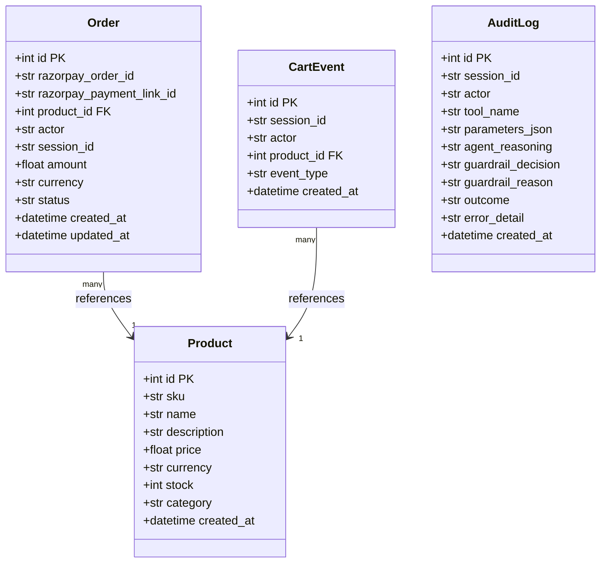
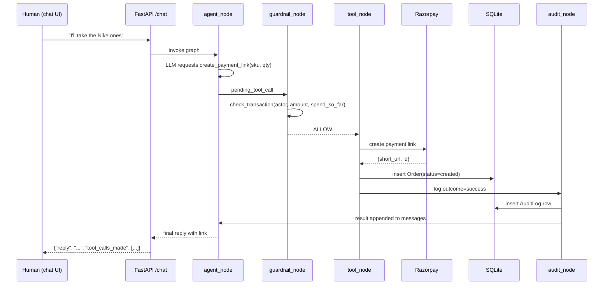
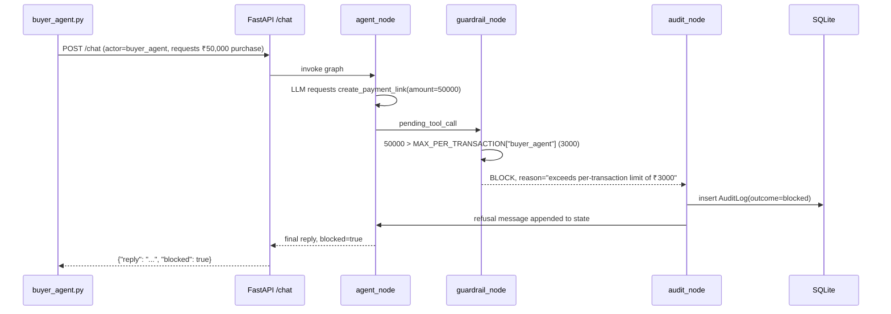

# GrowthMate — Low-Level Design (LLD)

> Companion to `docs/ARCHITECTURE.md`. That document says what talks to what and why.
> This document says exactly what fields, functions, and payloads exist, so implementation
> in Steps 2–7 is a direct translation of this file into code.

---

## 1. Scope

Covers: DB schema, REST API contracts, LLM tool JSON schemas, guardrail rule logic,
LangGraph node/state design, Razorpay integration detail, and sequence diagrams for
both journeys. Written before code so every later step is "translate this section,"
not "design while coding under deadline pressure."

---

## 2. Database Schema



### 2.1 `products`

| Column | Type | Constraints | Notes |
|---|---|---|---|
| id | Integer | PK, autoincrement | |
| sku | String(50) | unique, not null | agent-facing stable identifier |
| name | String(200) | not null | |
| description | Text | nullable | |
| price | Float | not null | in `currency` units, e.g. 1499.00 |
| currency | String(3) | not null, default `"INR"` | |
| stock | Integer | not null, default 0 | |
| category | String(100) | nullable | used for growth insights grouping |
| created_at | DateTime | default `utcnow` | |

### 2.2 `orders`

| Column | Type | Constraints | Notes |
|---|---|---|---|
| id | Integer | PK | |
| razorpay_order_id | String(100) | nullable, indexed | set once Razorpay order created |
| razorpay_payment_link_id | String(100) | nullable, indexed | set once payment link created |
| product_id | Integer | FK → products.id | |
| actor | String(50) | not null | `"human"` or `"buyer_agent"` |
| session_id | String(100) | not null, indexed | groups a conversation/session |
| amount | Float | not null | snapshotted at order-creation time |
| currency | String(3) | not null | |
| status | String(30) | not null, default `"created"` | `created` → `paid` \| `failed` \| `blocked` |
| created_at | DateTime | default `utcnow` | |
| updated_at | DateTime | default `utcnow`, onupdate `utcnow` | updated by webhook |

### 2.3 `cart_events`

| Column | Type | Constraints | Notes |
|---|---|---|---|
| id | Integer | PK | |
| session_id | String(100) | not null, indexed | |
| actor | String(50) | not null | |
| product_id | Integer | FK → products.id | |
| event_type | String(30) | not null | `"viewed"` \| `"searched"` \| `"abandoned"` \| `"purchased"` |
| created_at | DateTime | default `utcnow` | |

Purpose: feeds `get_growth_insights` (e.g., "searched but never purchased" = abandonment signal).

### 2.4 `audit_log`

| Column | Type | Constraints | Notes |
|---|---|---|---|
| id | Integer | PK | |
| session_id | String(100) | not null, indexed | |
| actor | String(50) | not null | |
| tool_name | String(50) | not null | e.g. `create_payment_link` |
| parameters_json | Text | not null | JSON string of tool arguments |
| agent_reasoning | Text | nullable | LLM's stated reasoning before the call, if available |
| guardrail_decision | String(20) | not null | `"ALLOW"` \| `"BLOCK"` \| `"N/A"` (non-money tools) |
| guardrail_reason | Text | nullable | e.g. "exceeds per-transaction limit of ₹5000" |
| outcome | String(20) | not null | `"success"` \| `"failed"` \| `"blocked"` |
| error_detail | Text | nullable | populated on `failed` (e.g. Razorpay API error) |
| created_at | DateTime | default `utcnow`, indexed | |

This is the table that makes "explainable, bounded, gated" literal and queryable.

---

## 3. REST API Contract

### `GET /health`
Response `200`: `{"status": "ok", "service": "growthmate-backend"}`

### `GET /catalog`
Agent-readable, no auth required (public browsing).

Response `200`:
```json
{
  "currency": "INR",
  "products": [
    {
      "sku": "SHOE-001",
      "name": "Nike Revolution 6",
      "description": "Lightweight running shoe",
      "price": 1899.0,
      "stock": 12,
      "category": "footwear"
    }
  ]
}
```
Design note: field names and units are explicit (`price` is a float in `currency`, not a string like `"₹1,899"`) — an external agent must be able to parse this with zero prior knowledge of our conventions.

### `POST /chat`
Request:
```json
{
  "session_id": "sess-abc123",
  "actor": "human",
  "message": "I need running shoes under 2000"
}
```
`actor` is one of `"human"` | `"buyer_agent"` — drives guardrail rules (Section 5).

Response `200`:
```json
{
  "session_id": "sess-abc123",
  "reply": "I found the Nike Revolution 6 at ₹1899. Want me to generate a payment link?",
  "tool_calls_made": ["search_catalog"]
}
```

Response `200` (blocked case — still 200, refusal is data, not an HTTP error):
```json
{
  "session_id": "sess-abc123",
  "reply": "I can't process that — it exceeds the per-transaction limit of ₹5,000 for this session.",
  "tool_calls_made": ["create_payment_link"],
  "blocked": true
}
```

### `GET /audit?session_id=sess-abc123`
Response `200`: array of `AuditLog` rows (JSON), most recent first. `session_id` filter optional — omit to view all (demo/admin use).

### `POST /webhook/razorpay`
Called by Razorpay, not by our frontend. Verifies `X-Razorpay-Signature` header via HMAC using `RAZORPAY_KEY_SECRET`, then updates the matching `Order.status`.

Response `200`: `{"status": "processed"}` — must always return 200 quickly, or Razorpay retries.

---

## 4. Tool Definitions (LLM-facing JSON Schemas)

These are what the LLM sees to decide what to call — defined once in `tools.py`, bound via LangChain, reused by both the manual loop and LangGraph.

```python
TOOLS = [
    {
        "name": "search_catalog",
        "description": "Search the product catalog by keyword and optional max price.",
        "input_schema": {
            "type": "object",
            "properties": {
                "query": {"type": "string"},
                "max_price": {"type": "number"}
            },
            "required": ["query"]
        }
    },
    {
        "name": "create_payment_link",
        "description": "Create a Razorpay payment link for a specific product and quantity. Money-moving — subject to guardrail check.",
        "input_schema": {
            "type": "object",
            "properties": {
                "sku": {"type": "string"},
                "quantity": {"type": "integer", "minimum": 1}
            },
            "required": ["sku", "quantity"]
        }
    },
    {
        "name": "get_order_status",
        "description": "Check the payment/order status for a given order id.",
        "input_schema": {
            "type": "object",
            "properties": {"order_id": {"type": "integer"}},
            "required": ["order_id"]
        }
    },
    {
        "name": "get_growth_insights",
        "description": "Return aggregate growth data: top products, abandonment patterns.",
        "input_schema": {"type": "object", "properties": {}, "required": []}
    }
]
```

Each tool's Python implementation lives in `tools.py`, one function per tool, returning
a plain JSON-serializable dict — never raising uncaught exceptions (Section 9).

---

## 5. Guardrail Layer LLD

`guardrail.py` — pure functions, no I/O, fully unit-testable in isolation.

```python
# Config (env-overridable, hardcoded default for hackathon)
MAX_PER_TRANSACTION = {"human": 5000.0, "buyer_agent": 3000.0}
MAX_PER_SESSION = {"human": 15000.0, "buyer_agent": 5000.0}
ALLOWED_ACTORS = {"human", "buyer_agent"}


def check_transaction(actor: str, amount: float, spend_so_far: float) -> GuardrailDecision:
    """
    Pure function: same inputs always produce same output.
    Returns a GuardrailDecision(allowed: bool, reason: str).
    """
```

`GuardrailDecision` is a small dataclass:
```python
@dataclass
class GuardrailDecision:
    allowed: bool
    reason: str
```

Rule order (first failing rule wins, reason is specific):
1. `actor not in ALLOWED_ACTORS` → block, `"unknown actor"`
2. `amount > MAX_PER_TRANSACTION[actor]` → block, `"exceeds per-transaction limit of ₹{limit}"`
3. `spend_so_far + amount > MAX_PER_SESSION[actor]` → block, `"exceeds per-session limit of ₹{limit}"`
4. else → allow, `"within limits"`

Called from the LangGraph `guardrail_node` — never from inside `tools.py`, so the
enforcement point is singular and auditable (one place to point to in your defense).

---

## 6. Agent Layer LLD (LangGraph)

### 6.1 State (from ARCHITECTURE.md, repeated here as the implementation contract)
```python
class AgentState(TypedDict):
    messages: list
    actor: str
    session_id: str
    spend_so_far: float
    pending_tool_call: dict | None
```

### 6.2 Node function signatures

```python
def agent_node(state: AgentState) -> AgentState:
    """Calls LLM with state['messages'] + TOOLS. Appends response to messages.
       If response requests a tool, sets state['pending_tool_call']."""

def route_after_agent(state: AgentState) -> str:
    """Conditional edge. Returns one of:
       'end' | 'guardrail' | 'tool' based on pending_tool_call content."""

def guardrail_node(state: AgentState) -> AgentState:
    """Reads pending_tool_call, calls guardrail.check_transaction(),
       writes decision into state, routes accordingly."""

def tool_node(state: AgentState) -> AgentState:
    """Executes the actual tool function from tools.py, appends tool
       result message, clears pending_tool_call."""

def audit_node(state: AgentState) -> AgentState:
    """Writes one AuditLog row using fields from state + last decision.
       Always runs, both ALLOW/success and BLOCK paths."""
```

### 6.3 Graph wiring
```python
graph = StateGraph(AgentState)
graph.add_node("agent", agent_node)
graph.add_node("guardrail", guardrail_node)
graph.add_node("tool", tool_node)
graph.add_node("audit", audit_node)

graph.set_entry_point("agent")
graph.add_conditional_edges("agent", route_after_agent, {
    "end": END, "guardrail": "guardrail", "tool": "tool"
})
graph.add_conditional_edges("guardrail", lambda s: s["last_decision"], {
    "ALLOW": "tool", "BLOCK": "audit"
})
graph.add_edge("tool", "audit")
graph.add_edge("audit", "agent")
```

### 6.4 System prompt (fixed skeleton, filled with catalog context at call time)
```
You are GrowthMate, a merchant's sales agent. You can search the catalog,
create payment links, check order status, and report growth insights.
Only call create_payment_link once the customer has clearly confirmed the
specific product and quantity. Never invent product data — always use
search_catalog results. If a tool call is blocked, explain the block
plainly and suggest a smaller purchase if relevant.
```

---

## 7. Razorpay Integration LLD

`razorpay_client.py`:
```python
def create_payment_link(order: Order) -> dict:
    """
    Calls Razorpay Payment Links API with order.amount, order.currency,
    a reference id = order.id. Returns {"short_url": ..., "id": ...}.
    On SDK exception: caught, returns {"error": str(e)} -- never raises
    up to the tool_node, so the graph can log outcome='failed' and continue.
    """

def verify_webhook_signature(payload_body: bytes, signature_header: str) -> bool:
    """
    HMAC-SHA256 of payload_body using RAZORPAY_KEY_SECRET, compared to
    signature_header via hmac.compare_digest (constant-time).
    """
```

Webhook handler (`main.py`):
1. Read raw body + `X-Razorpay-Signature` header.
2. `verify_webhook_signature` — if false, return `400`, log nothing further (don't trust unverified payloads).
3. Parse `event` field (`payment_link.paid`, `payment_link.expired`, etc.).
4. Look up `Order` by `razorpay_payment_link_id`, update `status`, `updated_at`.
5. Return `200` immediately.

---

## 8. Sequence Diagrams

### 8.1 Journey A — normal purchase (human)



### 8.2 Journey B — engineered failure (buyer_agent.py)



---

## 9. Error Handling Matrix

| Failure point | Handling | Returned to caller |
|---|---|---|
| LLM API timeout/error | Caught in `agent_node`, retried once, else fallback message | `200` with apologetic reply, no crash |
| Guardrail block | Not an error — expected control flow | `200`, `"blocked": true` |
| Razorpay API error | Caught in `razorpay_client.py`, tool returns `{"error": ...}` | `tool_node` logs `outcome=failed`, agent explains failure in plain language |
| Invalid webhook signature | Rejected at verification step | `400`, nothing written to DB |
| Malformed `/chat` request | Pydantic validation | `422` (FastAPI default) |
| Unknown `actor` value | Guardrail rule 1 | Treated as BLOCK, logged |
| DB write failure | Caught around session commit, rolled back | `500` with generic message, logged to server console (not silently swallowed) |

---

## 10. File-to-Responsibility Map

| File | Owns |
|---|---|
| `app/main.py` | Routes only — no business logic, delegates to agent/tools |
| `app/models.py` | SQLAlchemy models (Section 2) |
| `app/schemas.py` | Pydantic request/response models (Section 3) |
| `app/tools.py` | Tool implementations matching Section 4 schemas |
| `app/guardrail.py` | Pure functions from Section 5 — no imports from `tools.py` or `main.py` |
| `app/agent_graph.py` | LangGraph wiring from Section 6 |
| `app/razorpay_client.py` | Section 7 |
| `buyer_agent.py` | Standalone script driving Journey B |
